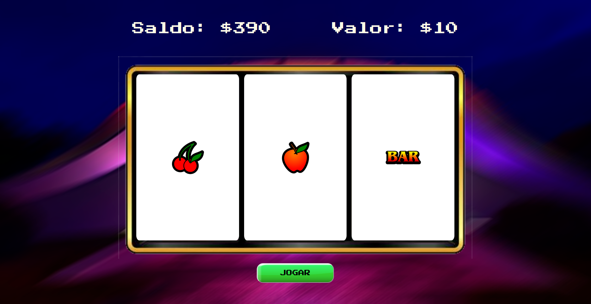

# Simple Slot Machine Game

This is a simple slot machine game built using HTML, CSS, and JavaScript. The game features three reels with various images, a start button to spin the reels, and dynamic display of balance and bet values.



## Author

I'm Barbara Calderon, a software developer from Brazil. 
- [Github](https://www.github.com/barbaracalderon)
- [Linkedin](https://www.linkedin.com/in/barbaracalderondev)
- [Twitter](https://www.x.com/bederoni)


## Technologies Used

**Frontend**

- HTML
- CSS
- JavaScript

**Backend**
- Flask
- GUnicorn

## Features
- Three reels with different images
- Start button to spin the reels
- Dynamic display of balance and bet values
- Casino-style design with "Press Start 2P" font
- The text content is in **Portuguese** language
- Deployed on the **Render platform**

## Motivation
The slot machine game was created as a challenge project to explore frontend skills and JavaScript programming. Initially, the intention was to use **Pixi.js** for graphics rendering, but due to time constraints and a steep learning curve (first time dealing with it), a simpler approach with basic HTML, CSS, and JavaScript was chosen. I also had plans to add a slot lever sound effect when pressing play, but was unable to find a free resource available.

## Getting Started

### Online

[Play: Simple Slot Machine Game](https://simple-slot-machine-game.onrender.com/)

### Locally

#### 1. Clone the repo

```bash
git clone git@github.com:barbaracalderon/simple-slot-machine-game.git
```

#### 2. Enter the project directory

```bash
cd project-name
```

#### 3. Install dependencies

Make sure you have Python installed.

```bash
pip install -r requirements.txt
```

#### 4. Run 

```bash
gunicorn --bind "0.0.0.0:80" wsgi:app
```

## Credits
- Font: "Press Start 2P" from Google Fonts
- Images: PNG format

